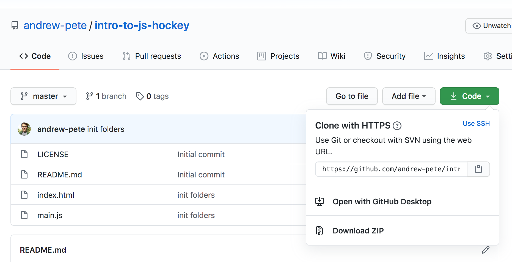

# An Introduction to Hockey Analytics with JavaScript 

I can do anything you can do (with a little more code, less elegantly) ((kidding)) (((kinda)))

## Is this tutorial for me?
This tutorial is perfect for anyone with _some_ experience of coding in languages that aren't JavaScript. It assumes that you have a little familiarity in the following areas:
- variables
- if (conditional) statements
- for loops

Now, don't run away (yet)! You can do it!! There are so many lovely tutorials for these coding fundamentals online, and I have full confidence that you can get it down. Then please come back xoxo.

Assuming you've tinkered a bit with R, Python, Java, or any other modern coding language, this tutorial should be right up your alley if you want to get some exposure to JavaScript and analyzing/visualizing hockey data!

## What can I expect to learn?
STOP! Have you checked out Meghan Hall's incredible [Intro to R with Hockey Data](https://meghan.rbind.io/post/learnr/)? If not, stop doing this and go check it out. This tutorial is actually borrowing the same tutorial structure, but adapting it for JavaScript. 

What started as a language to perform simple scripts and allow for wacky website interactivity has morphed--for better or worse--into the language that powers a majority of modern web applications. 

You've probably been avoiding it for years. You make fun of it to your other enlightened friends. "There are no rules," you say. But secretly you want to know what all the hypes about. Suddenly, you've got this great project idea (an app, a website, a very specific visualization) and you have the daunting realization that it means you have to **finally** have to crack open a can o' JavaScript. 

Now you're here. Welcome. Pull up a chair, pop open a bottle of Pinot Noir (ideally from Washington State, IMO), and fire up the old text editor.

The purpose of this tutorial is to teach some of the things that make JavaScript so powerful (and neat). By the end of this, you'll know how to filter data, manipulate data, and create a beautiful bar chart visualization using d3.js.

## Getting Started
Before we code, you need the code! If you're familiar with git, [fork this repository](https://docs.github.com/en/github/getting-started-with-github/fork-a-repo) so you have a personal copy. Otherwise, click the green button on the main page and download the zip file.



Once you have the code locally, open up your favorite text editor. Don't have one? I prefer [VS Code](https://code.visualstudio.com/download).

## Fundamentals

Before we get into the nitty gritty, it's important to go over some fundamentals.

### Variables
In JS, we can store values on a named "variable." I use quotes because most of the time, the variable is actually constant. The syntax-coating you use depends on the situation. For something that is constant, we prefix the variable name with `const`.

For a variable that will be updated, we use `let`.

90% of the time, `const` is the way to go. Here's a simple example that uses both.

```javascript
// numRows is constant. we aren't updating it, so use `const`
const numRows = 10;
// for loops re-use the same variable when incrementing. a perfect example of `let` being necessary
for (let i = 0; i < numRows; i++) {
    ...
}

```

If that's already making your brain hurt, don't fret. You can _always_ use `let`. It's just some people, myself including, are sticklers.


### Functions
Functions are crucial to writing good, safe code. It encapsulates your code in a safe little bubble (called a "scope") and prevents a lot of mysterious side-effects if used correctly.

They can be defined in a few different ways:
```javascript
function boo() {
    console.log("BOOOOO!");
}

// assigning to a const. WOAH
const booGaryBetman = function() {
    console.log("[To Gary Bettman]");
    boo();
}

// defined using es6 arrow syntax
const booGaryBetmanES6 = () => {
    booGaryBetman();
};
```

Implicit in the last two examples are that you can create these magical things called "anonymous functions." They can be assigned to variables, passed into other functions, or even executed immediately!

The major divergence in JavaScript from most other coding languages is the fact that it treats functions just like any other primitive type (number, string, boolean, etc...). This is a characteristic of functional programming languages, which is equally powerful as it is mind-boggling. Passing in functions to functions?! Who needs that? 

(It's you. You do).

If you've done Meghan's R tutorial, you should be familiar with the R functions `filter` and `mutate`. Those functions can be found in JavaScript, under the names `filter` and `map` respectively. They can be called on any array (a.k.a. list) of data, and they rely on a function being passed in as an argument.

In order to brush up on this, let's do a little example, followed by a challenge! It's a crucial building block even though it's not hockey related.

#### Higher Order Functions - Example
Let's first define a couple of ordinary functions, `add` and `multiply`. Each should anticipate two arguments `x` and `y` and return the result of the expected arithmetic.

```javascript
/**
 * A good coder always documents their code :) 
 * 
 * @param {Number} x first argument
 * @param {Number} y second argument
 */
function add(x, y) {
    return x + y;
}

function multiply(x, y) {
    return x * y;
}
```

These functions can be executed, like so
```
add(2, 5);
> 7

multiply(5, 5);
> 25
```

They can even be called by other functions.

```javascript
function addOne(x) {
    return add(x,1);
}
```

Let's say we wanted to think more abstractly. Each of these functions is an operand (`add`, `multiply`) being applied to two operands (`x`, `y`). What if we wanted to create an abstract `operate` function, that takes in an operator and two operands?

```javascript
/**
 * Performs operator on operands 1 and 2
 * 
 * @param {Function} operator
 * @param {Number} operand1
 * @param {Number} operand2
 */
function operate(operator, operand1, operand2) {
    return operator(operand1, operand2);
}
```

Now, we can call this with our two already defined functions.

```

operate(add, 2, 3);
> 5
operate(multiply, 5, 5);
> 25
```

We can even define an _anonymous function_ and pass that into the operate function directly.

```javascript
// returns 3 - 2 -> 1
operate(function(x,y) {
    return x - y;
}, 3, 2);

// equivalent to
operate((x,y) => x - y, 3, 2);
```

Wow! You're first higher-order function.

#### Higher Order Functions: Challenge Exercise
Let's try something new. Navigate to the file `function.js` inside of the `modules` folder. There, we have a completed `forEach` function along with the skeletons of two other higher-order functions, `map` and `filter`.

First, you need to start up a local server __from the root of the project directory__.
If you have python installed, the easiest way to do that is either:

For python version < 3
```
python -m SimpleHTTPServer 8000
```

Python version > 3
```
python3 -m http.server 8000
```

Then open up a browser and go to localhost:8000/test

The goal of 